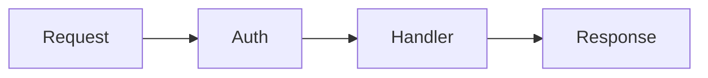

# Diagram

Generate diagrams for technical content. Supports D2 (styled SVGs) and Mermaid (inline markdown).

## Format Selection

| Use Case | Format | Why |
|----------|--------|-----|
| Markdown docs (GitHub/GitLab) | Mermaid | Native rendering, no build step |
| Web pages needing polish | D2 | Custom colors, design tokens |
| Simple flowcharts | Mermaid | Less syntax, faster |
| Complex architecture | D2 | Better layout control |
| No CLI available | Mermaid | Zero dependencies |

Ask user if unclear: "Mermaid (inline markdown) or D2 (styled SVG)?"

## When to Suggest

Proactively offer diagrams for:
- Decision logic ("if X then Y")
- Multi-step processes (3+ steps)
- Architecture/data flow
- Comparisons with branching outcomes

## Artifacts

**Reads:**
- `.claude/context/design-tokens.md` - Brand colors (if exists)

**Creates:**
- `<name>.d2` - D2 source
- `public/<page-path>/<name>.svg` - Generated SVG

**Requires:** d2 CLI for D2 diagrams (Mermaid needs nothing)

## Workflow

### 0. Check Prerequisites (D2 only)

```bash
which d2
```

If d2 not found, suggest: `brew install d2` or `go install oss.terrastruct.com/d2`. If user can't install, fall back to Mermaid.

### 1. Extract Design Tokens (First Run)

If `design-tokens.md` doesn't exist, check in order:
1. `tailwind.config.ts` - `theme.extend.colors`
2. `app.config.ts` - `ui.primary`, `ui.gray`
3. `assets/css/main.css` - CSS custom properties

Write to `.claude/context/design-tokens.md`. See `references/design-tokens.md` for format.

### 2. Output Path

Derive from current page: `content/docs/guide/meta.md` → `public/docs/guide/meta/<name>.svg`

### 3. Create Diagram

Keep minimal: max 10-12 nodes, single concept, clear flow direction. See `references/d2-syntax.md` for patterns and `examples/` for working samples.

Use design tokens for theming:
- `primary` for decisions/key paths
- `success` for recommended outcomes
- `gray` for defaults
- `border-radius: 8`, `shadow: true`

If diagram needs 12+ nodes, split into multiple diagrams.

### 4. Generate SVG

```bash
d2 --pad 24 --theme 0 <name>.d2 public/<path>/<name>.svg
```

### 5. Link in Content

```md

```

## Alt Text

Write what the diagram concludes, not its structure:
- Good: "Use SSR if content needs indexing; otherwise SPA"
- Bad: "Flowchart showing SSR decision"

## Accessibility

- Use shape + color together for meaning (not color alone)
- Prefer high-contrast color pairs from design tokens
- Add labels on edges, not just color-coded paths
- Colorblind-safe: avoid red/green only distinctions - use blue/orange or add patterns

## Mermaid Workflow

For Mermaid diagrams (inline markdown):

### 1. Choose Diagram Type

| Content | Type |
|---------|------|
| Decision logic | `flowchart` |
| API/component interaction | `sequenceDiagram` |
| Lifecycle states | `stateDiagram-v2` |
| Data models | `erDiagram` |
| Git branching | `gitGraph` |

### 2. Write Inline

Insert directly in markdown:

~~~md

~~~

See `references/mermaid-syntax.md` for full syntax.

### 3. Keep Simple

- Max 8-10 nodes (simpler than D2)
- Minimal styling - Mermaid's strength is clarity
- Short labels (2-3 words)
- Consistent direction (TD or LR)

No build step needed - GitHub/GitLab/Nuxt Content render automatically.
