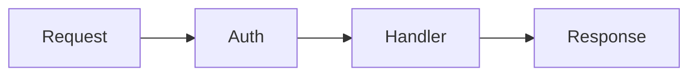

# Diagram

Generate diagrams for technical content. Claude invokes this when content would benefit from visual explanation.

**Arguments:** `$ARGUMENTS`

## Format Selection

| Use Case | Format |
|----------|--------|
| Markdown docs (GitHub/GitLab) | Mermaid (native rendering, zero deps) |
| Web pages needing polish | D2 (custom colors, design tokens) |
| No CLI available | Mermaid |

## When to Suggest

Proactively offer for: decision logic, multi-step processes (3+), architecture/data flow, branching comparisons.

## D2 Workflow

1. Check `which d2` — fall back to Mermaid if missing
2. Read `.claude/context/design-tokens.md` or extract tokens from `tailwind.config.ts` / `app.config.ts` / CSS
3. Create diagram (max 10-12 nodes, single concept)
4. `d2 --pad 24 --theme 0 <name>.d2 public/<path>/<name>.svg`
5. Link: ``

See `${CLAUDE_SKILL_DIR}/references/d2-syntax.md` and `${CLAUDE_SKILL_DIR}/references/design-tokens.md`.

## Mermaid Workflow

Insert inline in markdown:

~~~md

```mermaid
flowchart LR
    Request --> Auth --> Handler --> Response
```
~~~

Types: flowchart, sequenceDiagram, stateDiagram-v2, erDiagram, gitGraph.
See `${CLAUDE_SKILL_DIR}/references/mermaid-syntax.md`.

Max 8-10 nodes. Short labels (2-3 words). Consistent direction.

## Alt Text

Describe the conclusion, not the structure:
- Good: "Use SSR if content needs indexing; otherwise SPA"
- Bad: "Flowchart showing SSR decision"
