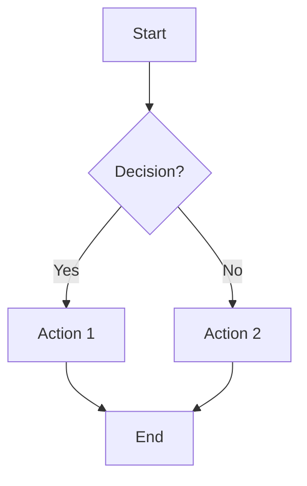
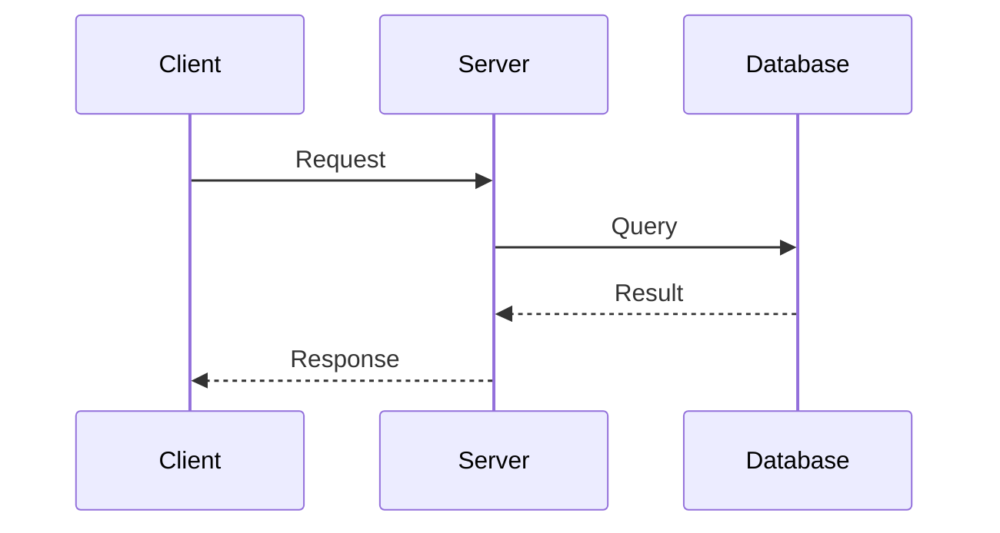
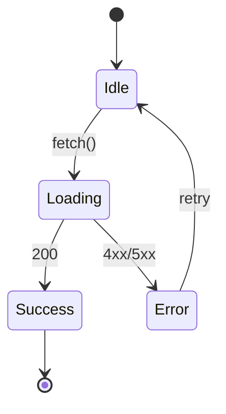
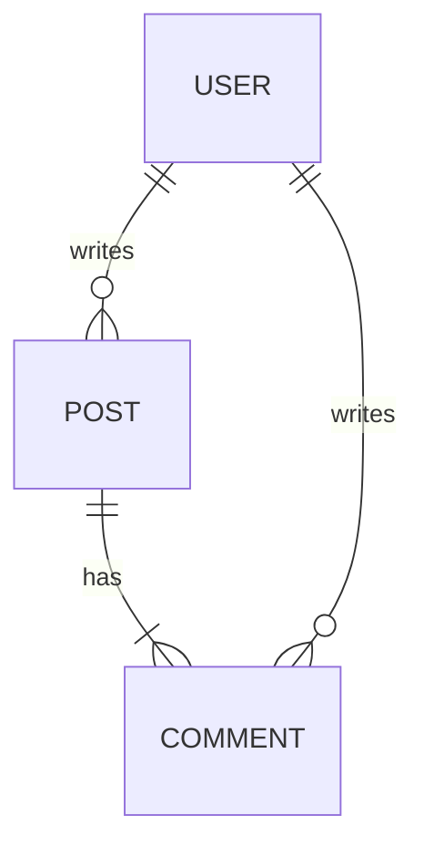
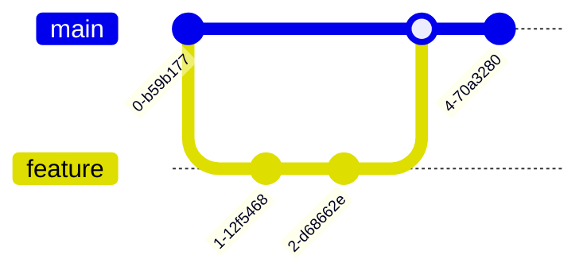
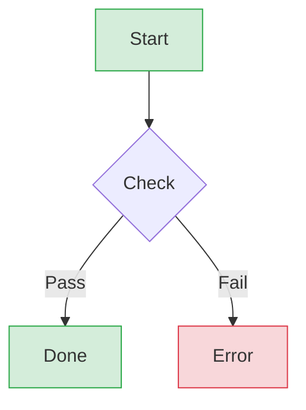
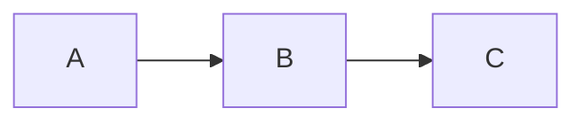

# Mermaid Syntax Reference

Use Mermaid when:
- Output is markdown (GitHub/GitLab renders natively)
- Simple diagrams without custom styling
- No CLI dependency needed
- Inline documentation

Use D2 when:
- Need custom colors/design tokens
- Complex layouts with precise control
- SVG output for web pages
- Visual polish matters

## Diagram Types

### Flowchart

Direction: `TD` (top-down), `LR` (left-right), `BT`, `RL`

### Sequence Diagram

Arrows: `->>` solid, `-->>` dashed, `-x` cross, `-)` async

### State Diagram

### Entity Relationship

Cardinality: `||` one, `o{` zero or more, `|{` one or more

### Git Graph

## Node Shapes

| Shape | Syntax | Use For |
|-------|--------|---------|
| Rectangle | `[text]` | Default, actions |
| Round | `(text)` | Start/end |
| Diamond | `{text}` | Decisions |
| Stadium | `([text])` | Terminal |
| Cylinder | `[(text)]` | Database |
| Hexagon | `{{text}}` | Preparation |

## Styling (Limited)

Keep styling minimal - Mermaid's strength is simplicity.

## Best Practices

1. **Max 8-10 nodes** - Split complex diagrams
2. **Consistent direction** - Pick TD or LR, stick with it
3. **Short labels** - 2-3 words max per node
4. **Meaningful IDs** - `Auth` not `A`, helps readability
5. **No redundant arrows** - Remove if flow is obvious

## Markdown Integration

Inline in markdown files:

~~~md

~~~

GitHub, GitLab, Notion, Obsidian render automatically.
